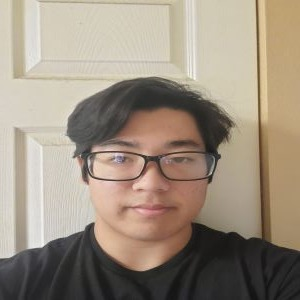

---
<a href=https://crisjavier.github.io/pending.zombies.io/><button>Home</button></a>
<a href="https://dustpending.github.io/pending.zombies.io/"><button>The Game</button></a>
<a href="contact-us"><button>Meet The Developers</button></a>
---
## The Team

### Justin Yip

Aspiring game designer with a passion for storytelling. An oldie at heart. Enjoys music from the 70’s and 80’s. Occasionally draws and composes music when not working on a game. Designer, programmer, artist, and musical scorer for the team.

 

 

### Kuliakaiwikuamoo (Kaiwi) Akioka

I am an aspiring functional adult who's main focus at the moment is graduating this semester. On the team I focus on boss design and helping where I can. I am also working with Justin on composing an OST. In my free time, I do judo and jiu jitsu, I also play games.

 

 

