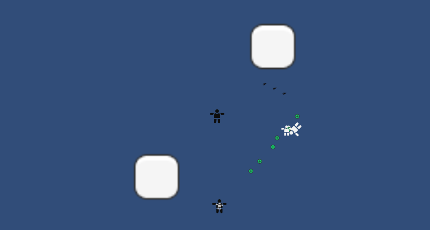
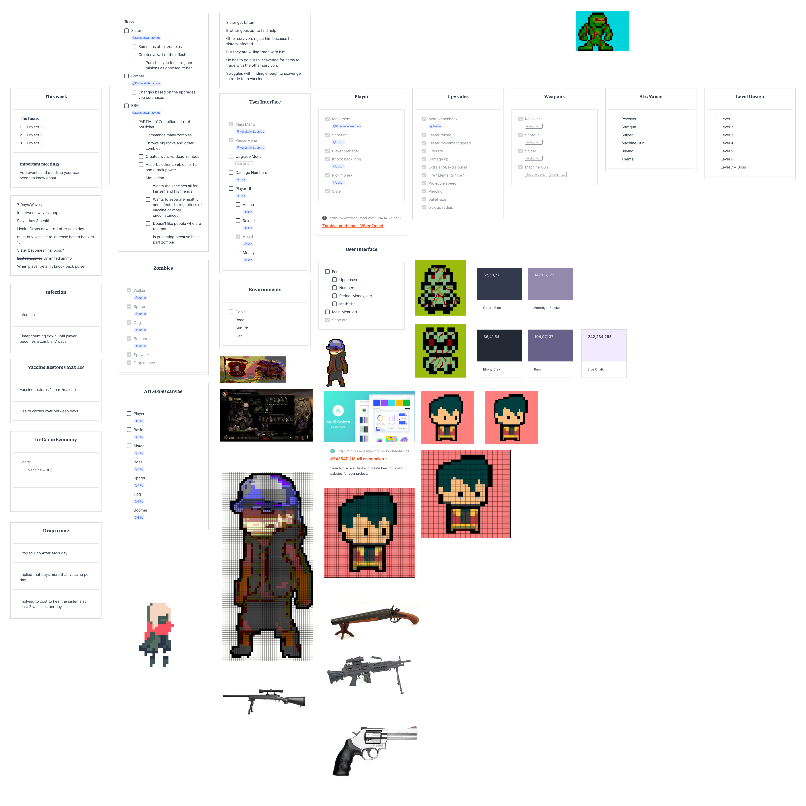

# An Answer for the Dust

---
<a href=""><button>Home</button></a>
<a href="https://dustpending.github.io/pending.zombies.io/"><button>The Game</button></a>
<a href="contact-us"><button>Meet The Developers</button></a>
---

## Different Pages
- [Meet the Developers!](contact-us.md)

## Table of Contents
- [Overview](#overview)
- [Development](#development)
- [Dev Diary](#dev-diary)
- [The Game](#the-game)
- [Meet the Developers](#meet-the-developers)

## Overview

### Synopsis
Society has crumbled. The World as we knew it is rotting. Strange behavior in the weather finds odd particles of dust set in the very air we breath. Set during the aftermath of a zombie outbreak in the United States, the game pits a survivor and their infected little sister against hordes of the infected. Setting out to do what our primal insticts as humans urge us to do. Survive. However, due to a lapse in judgement, his little sister manages to get infected. Now must he set out to find a cure and save his sister. Hoping to somehow against all odds find an answer for the dust.

### Our Vision
With An Answer to the Dust, our vision is to create an immersive and thrilling gaming experience that transports players into a dark and dangerous world filled with all types of zombies. We aim to deliver a game that not only challenges players with strategic combat and resource management, but also draws them in with rich storytelling and character development. Our goal is to create a game that keeps players on the edge of their seats as they navigate through treacherous environments, and confront formidable enemies. We believe that the combination of intense gameplay, atmospheric world-building, and engaging narrative will create an unforgettable experience for players that they'll want to return to again and again.

## Development

### Projectiles and Shooting

Shooting in games is done in one of two ways. They either use raycasts or spawn game objects bullets from a designated firing point. Our game we decided to use the spawning method. One hurdle I had to figure out was how to spawn multiple bullets in a fixed pattern. When the player upgrades their weapon to increase their projectile count, bullets need to be spawned in a fan-like pattern. My first attempt to deal with this problem was to create new firing points for each bullet. This would prove to be problematic when the projectile count increased and the firing pattern changed. There would be way too many firing points that would need to be managed. Instead I manipulated the single firing point and rotated it to create the fan-shaped pattern. I was able to do this by creating a switch statement and assigning each case according to the number of projectiles. I would spawn bullets in each of the desired directions then use a helper script to give each bullet the correct values and force. This of course still had its downsides, the pattern was hard coded into the script and if it were to be changed, one would need to open the script and change them manually. This reduced the amount of firing points to just one and removed the need to create more than a dozen different firing points for the different patterns. In addition, if I wanted to create a new pattern with an additional projectile I would have to code that pattern manually into the script.

### Storyboard

### Work Distribution & Task Management

#### 2/15/2023

#### 3/18/2023

Please zoom in to get a clearer view of our taskboard!

## The Game

At the moment, to get the full intended experience, please make sure to click on the fullscreen button or go into options and enable fullscreen!

[The Game](https://dustpending.github.io/pending.zombies.io/)

## Dev Diary

### Cris Javier

This project has really opened my eyes to how a video game production group can be. It's nowhere near what a normal company would be like but the environments and work-flow seem to be very similar. This game is looking to be very fun yet challenging. We're working very hard on making the underlying themes of 'sacrifice' and 'hope' very apparent. However, at the current moment those implementaitons are nothing more than ideas on our task manager board. I hope to be able to see this project to completion and produce a product I am happy to have my name on!

### Justin Yip

As a developer on An Answer to the Dust, I'm excited to be part of a team that's creating an immersive gaming experience that pushes the boundaries of what's possible in the genre. It's challenging, but also incredibly rewarding to see our vision for the game come to life as we build and refine it. The attention to detail and passion for the project that everyone on the team brings to the table is truly inspiring, and I can't wait to see how players react to the game when it's released.

### Billy Kane

Working on An Answer to the Dust has been a dream come true for me. As a lifelong fan of horror and survival games, I'm thrilled to be working on a project that combines those two elements in such a unique and exciting way. The team has been amazing to work with, and the collaborative nature of our development process has allowed us to bring a variety of different perspectives and skills to the table. I'm incredibly proud of what we've accomplished so far, and I can't wait to see what we'll achieve in the future.

### Kaiwi Akioka

It's been a challenging experience working on An Answer to the Dust, but also an incredibly rewarding one. From the early stages of development to the final push towards release, it's been inspiring to see the game take shape and become something truly special. The attention to detail and dedication of the team is truly impressive, and I feel fortunate to be working alongside such talented individuals. The long hours and hard work have been worth it, and I'm excited to see how the game is received by players when it finally hits the market.
---

---
